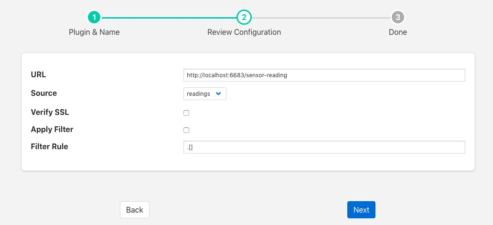

.. Images

.. Links
.. |http-c| raw:: html

   <a href="../fledge-north-httpc/index.html">C++ version</a>

.. |http-south| raw:: html

   <a href="../fledge-south-http_south/index.html">South service</a>

North HTTP
==========

The *fledge-north-http* plugin allows data to be sent from the north of one Fledge instance into the south of another Fledge instance. It allows hierarchies of Fledge instances to be built. The Fledge to which the data is sent must run the corresponding |http-south| in order for data to flow between the two Fledge instances. The plugin supports both HTTP and HTTPS transport protocols and sends a JSON payload of reading data in the internal Fledge format.

The plugin may also be used to send data from Fledge to another system, the receiving system should implement a REST end point that will accept a POST request containing JSON data. The format of the JSON payload is described below. The required REST endpoint path is defined in the configuration of the plugin.

Filters may be applied to the connection in either the north task that loads this plugin or the receiving south service on the up stream Fledge.

A |http-c| of this plugin exists also that performs the same function as this plugin, the pair are provided for purposes of comparison and the user may choose whichever they prefer to use.

To create a north task to send to another Fledge you should first create the |http-south| that will receive the data. Then create a new north tasks by;

  - Selecting *North* from the left hand menu bar.

  - Click on the + icon in the top left

  - Choose http_north from the plugin selection list

  - Name your task

  - Click on *Next*

  - Configure the plugin

    +----------+
    | |http_1| |
    +----------+

    - **URL**: The URL of the receiving |http-south|, the address and port should match the service in the up stream Fledge. The URL can specify either HTTP or HTTPS protocols.

    - **Source**: The data to send, this may be either the reading data or the statistics data

    - **Verify SSL**: When HTTPS rather the HTTP is used this toggle allows for the verification of the certificate that is used. If a self signed certificate is used then this should not be enabled.

    - **Apply Filter**: This allows a simple jq format filter rule to be applied to the connection. This should not be confused with Fledge filters and exists for backward compatibility reason only.

    - **Filter Rule**: A jq filter rule to apply. Since the introduction of Fledge filters in the north task this has become deprecated and should not be used.

  - Click *Next*

  - Enable your task and click *Done*

JSON Payload
------------

The payload that is sent by this plugin is a simple JSON presentation of a set of reading values. A JSON array is sent with one or more reading objects contained within it. Each reading object consists of a timestamp, an asset name and a set of data points within that asset. The data points are represented as name value pair  JSON properties within the reading property.

The fixed part of every reading contains the following

+-----------+----------------------------------------------------------------+
| Name      | Description                                                    |
+===========+================================================================+
| timestamp | The timestamp as an ASCII string in ISO 8601 extended format.  |
|           | If no time zone information is given it is assumed to indicate |
|           | the use of UTC.                                                |
+-----------+----------------------------------------------------------------+
| asset     | The name of the asset this reading represents.                 |
+-----------+----------------------------------------------------------------+
| readings  | A JSON object that contains the data points for this asset.    |
+-----------+----------------------------------------------------------------+

The content of the *readings* object is a set of JSON properties, each of which represents a data value. The type of these values may be integer, floating point, string, a JSON object or an array of floating point numbers.

A property

.. code-block:: console

    "voltage" : 239.4

would represent a numeric data value for the item *voltage* within the asset. Whereas

.. code-block:: console

    "voltageUnit" : "volts"

Is string data for that same asset. Other data may be presented as arrays

.. code-block:: console

   "acceleration" : [ 0.4, 0.8, 1.0 ]

would represent acceleration with the three components of the vector, x, y, and z. This may also be represented as an object

.. code-block:: console

   "acceleration" : { "X" : 0.4, "Y" : 0.8, "Z" : 1.0 }

both are valid formats within Fledge.

An example payload with a single reading would be as shown below

.. code-block:: console

    [
       {
           "timestamp" : "2020-07-08 16:16:07.263657+00:00",
           "asset"     : "motor1",
           "readings"  : {
                         "voltage"  : 239.4,
                         "current"  : 1003,
                         "rpm"      : 120147
                         } 
       }
   ]

